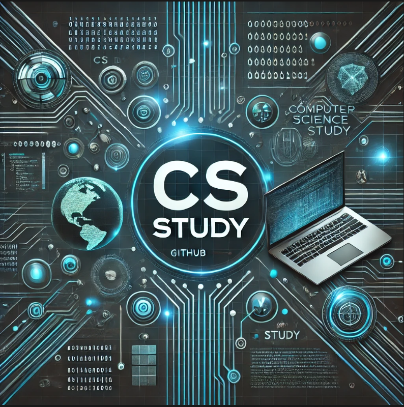
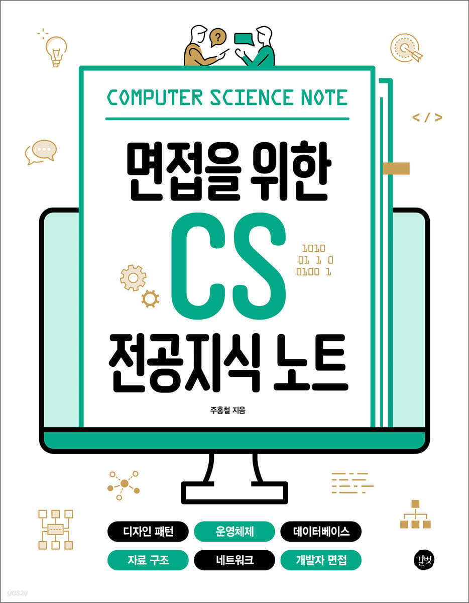
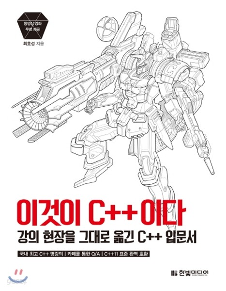

# CS-study

---

## 1. Introduction  

### 📚 Contents  

- [교재 및 강의] 
### 교재 : 면접을 위한 CS 전공지식 노트 주홍철 저 

### 교재 : 이것이 C++이다 최호성 저

### 강의 : 널널한 개발자 TV, C개발자를 위한 최소한의 C++
* 무료 인강 : [널널한 개발자 TV](https://www.youtube.com/watch?v=kq6b5zBkQ28&list=PLVsNizTWUw7EngGgS-7jWdgy5NgkIjHxz)
* 유료 인강 : https://inf.run/wo9Da

### 🕑 Schedule

시작일자 : 시범 운영 12/31, 1/2 / 1월부터 운영.

-  일자 : 매주 수, 금 (주2회) / 월 8회

---  

### 📋 method

#### 수요일
- 정해진 진도기반 자가학습 후, 파일 또는 url 업로드. “수기 필기본(테블릿 가능), 블로그게시물, notion 정리, github 등” (단순 타이핑 문서 인정X)
- 교재 특성상 깊은 내용을 다루고 있지 않음. 추가 전공서적, 인강, 유튜브 등 다양한 경로를 통해 깊이 있는 자가학습을 권장(마감일당 한개 이상 파일 및 url 제출)

#### 금요일
- 타인 제출물을 모두 정독, 본인이 놓친 개념이나 추가적으로 알게된 부분들을 통한 추가 게시물 혹은 게시글 편집 (편집시 추가 기제된 내용이 직관적으로 드러나게 작성할 것)
- 없어서 안했다 불가능, 없다면 축소 요약본과 같은 본인만의 방식으로 추가 게시물 게시
> ex) 면접 대비 예상 질문 및 답변 게시물 등등 -> 복습이 목적이기에 반드시 수행

------
## 2. ⛳ Curriculum 

### 24.12.30 ~ 25.02.24  : CS 전공지식 노트 , 이것이 C++이다.

| Week    | Learning Content Title        | Details of Learning Content                        | Completion   |
|---------|-------------------------------|----------------------------------------------------|--------------|
| Week 1 - 1| 면접을 위한 CS 전공  지식 노트  | 네트워크 | ✅         |
| Week 1 - 2 | 면접을 위한 CS 전공  지식 노트  | 네트워크 |  ✅          |
| Week 2 - 1 | 면접을 위한 CS 전공  지식 노트  | 운영체제          | ✅           |
| Week 2 - 2  | 면접을 위한 CS 전공  지식 노트  | 운영체제 | ✅           |
| Week 3 - 1  | 면접을 위한 CS 전공  지식 노트  | 데이터베이스  | 📅         |
| Week 3 - 2  | 면접을 위한 CS 전공  지식 노트 |  데이터베이스 | 📅           |
| Week 4 - 1  | 면접을 위한 CS 전공  지식 노트| 자료구조 C++ STL 컨테이너   |    📅     | 
| Week 4 - 2  | 면접을 위한 CS 전공  지식 노트  | 자료구조 C++ STL 컨테이너 | 📅         |
| Week 5 - 1  | 이것이 C++이다. |  chapter 1-3  |    📅     | 
| Week 5 - 2  | 이것이 C++이다.  | chapter 1-3  | 📅         |
| Week 6 - 1  | 이것이 C++이다.  | chapter 4-6 | 📅         |
| Week 6 - 2  | 이것이 C++이다.  | chapter 4-6 | 📅         |
| Week 7 - 1 | 이것이 C++이다.  | chapter 7-8  | 📅         |
| Week 7 - 2 | 이것이 C++이다.  | chapter 7-8 | 📅         |
| Week 8 - 1 | 이것이 C++이다.  | chapter 10-12 | 📅         |
| Week 8 - 2  | 이것이 C++이다.  | chapter 10-12 | 📅         |

---

## 3. Reference  

(0) [운영체제 스터디](https://github.com/yeongjinjeong/Operating-System-Study.git) - README.md 형식 참고

---

